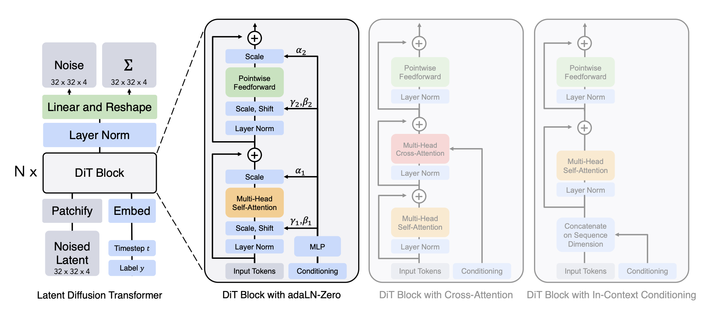

# Deep Generative Modeling: Diffusion Models

## Overview
In this programming assignment, we will touch upon three important follow-up works of Denoising Diffusion Probabilistic Model (DDPM): Denoising Diffusion Implicit Model (DDIM), Diffusion Transformer (DiT), and Video Denoising Model (VDM). A brief introduction of these three frameworks is illustrated as follows.

## Denoising Diffusion Implicit Model
[Denoising Diffusion Implicit Model (DDIM)](https://arxiv.org/pdf/2010.02502) is an extension of the Denoising Diffusion Probabilistic Model (DDPM), which aims to achieve more efficient sampling by generalizing the forward diffusion process used by DDPMs, which is Markovian, to non-Markovian ones. These non-Markovian processes can correspond to generative processes that are deterministic, giving rise to implicit models that produce high quality samples much faster. Specifically, DDIM generates a sample $\textbf{x}_{t−1}$ from $\textbf{x}_{t}$ via the following formula:
$$
\textbf{x}_{t−1} = \sqrt{\alpha_{t-1}}(\frac{\textbf{x}_{t} - \sqrt{1-\alpha_{t}}\epsilon_{\theta}^{(t)}(\textbf{x}_{t})}{\sqrt{\alpha_{t}}}) + \sqrt{1 - \alpha_{t-1} - \sigma_{t}^2} \cdot \epsilon_{\theta}^{(t)}(\textbf{x}_{t}) + \sigma_{t}\epsilon_{t}, \\
\sigma_{t} = \eta \sqrt{\frac{1 - \alpha_{t-1}}{1 - \alpha_{t}}} \sqrt{\frac{1 - \alpha_{t}}{\alpha_{t-1}}},
$$
where $\epsilon_{t} \sim \mathcal{N}(\textbf{0}, \textbf{I})$ is a standard Gaussian noise independent of $\textbf{x}_{t}$, and we define $\alpha_{0} := 1$. **Notably, $\eta$ is a hyperparameter that trades off between the deterministic DDIM and the stochastic DDPM: when $\eta$ = 1, the forward process becomes a Markovian DDPM; conversely, when $\eta$ = 0, the forward process becomes a deterministic DDIM.**

## Diffusion Transformer
There are two common backbone architecture choices for diffusion models: U-Net and Transformer. [Diffusion Transformer (DiT)](https://arxiv.org/pdf/2212.09748) replaces the commonly-used U-Net backbone with a [Vision Transformer (ViT)](https://arxiv.org/pdf/2010.11929) that operates on latent patches. Specificially, the input images will be firstly compressed into smaller latent representations using a learned encoder $E$, then these latent inputs will be decomposed into patches and processed by several DiT blocks, which are built upon the ViT architecture. The architecture of DiT is illustrated as follows.
<figure>
    
    <figcaption>Figure 1: Architecture of DiT.</figcaption>
</figure>

## Video Denoising Model
[Video Denoising Model (VDM)](https://arxiv.org/pdf/2204.03458) adopts the standard DDPM setup with an altered architecture suitable for video generation. Specifically, VDM extends the 2D U-Net to work for 3D data, where each feature map represents a 4D tensor of **frames × height × width × channels**. This 3D U-Net is factorized over space and time, meaning that each layer only operates on the space or time dimension (but not both). The architecture of 3D U-Net is illustrated as follows.
<figure>
    
    <figcaption>Figure 2: Architecture of the 3D U-Net in VDM.</figcaption>
</figure>

 
## Problem Descriptions
You are asked to reproduce part of the experiments, analyze the results, and answer some analytical questions for **one of the three** aforementioned models. The detailed problem set descriptions for each model is illustrated as follows.

### Problem Set for DDIM
Please follow [the official implementation](https://github.com/ermongroup/ddim) to reproduce DDIM, and answer the following questions:
- **Question 1 (3 points)**: Using the LSUN Church dataset (parameter name: --config church.yml), please change the number of steps (parameter name: --timesteps), and analyze how the number of steps affects the quality of generated images. Please use both quantitative measure (FID score) and qualitative measure (a series of generate images at different settings of timesteps) to report your findings. Note that [Frechet Inception Distance (FID)](https://en.wikipedia.org/wiki/Fr%C3%A9chet_inception_distance) is a metric used to evaluate the quality of generated images.
- **Question 2 (4 points)**: As discussed before, $\eta$ is an essential hyperparameter in DDIM that controls the level of stochasticity during the reverse denoisng process. By adjusting $\eta$, you can balance between determinism (for faster sampling with fewer steps) and stochasticity (for greater sample diversity). Using the LSUN Church dataset (parameter name: --config church.yml), please change $\eta$ (parameter name: --eta), and analyze how $\eta$ affects the sampling speed and the quality of generated images. Please use both quantitative measure (FID score and sampling time in hours/minutes) and qualitative measure (a series of generate images at different settings of $\eta$) to report your findings.
- **Question 3 (3 points)**: (i) What does the word *implicit* actually mean in DDIM? (ii) What do you think are some limitations of DDIM? Please answer this question in text format. Note that this is an open question, and there are no right or wrong answers.

- **Optional Bonus Question (Up to 3 points)**: Please conduct experiments on the [ImageNet dataset](https://www.image-net.org/) and report your findings (You are free to choose the specific experiments to conduct).

### Problem Set for DiT
Please follow [the official implementation](https://github.com/facebookresearch/DiT/tree/main) to reproduce DiT, and answer the following questions:
- **Question 1 (3 points)**: Using the provided pre-trained DiT checkpoint in the official implementation, please change the number of steps (parameter name: --num-sampling-steps), and analyze how the number of steps affect the quality of generated images. Please use both quantitative measure (FID score) and qualitative measure (a series of generate images at different settings of timesteps) to report your findings. 
- **Question 2 (3 points)**: In DiT, [classifier-free guidance](https://arxiv.org/pdf/2207.12598) is an important technique that can yield significantly improved samples over generic sampling techniques. Under the same setting as Question 1, please change the classifier-free guidance scale (parameter name: --cfg-scale) and analyze how different classifier-free guidance scale affects the quality of generated images. Please use both quantitative measure (FVD score) and qualitative measure (a series of generate images at different settings of classifier-free guidance scale) to report your findings. 
- **Question 3 (4 points)**: (i) What is Adaptive Layer Norm (adaLN) in DiT? Why can adaLN yield better performance than in-context conditioning and cross-attention? (ii) What do you think are some limitations of DiT? Please answer this question in text format. Note that this is an open question, and there are no right or wrong answers.

- **Optional Bonus Question (Up to 6 points)**: The original DiT implemenation only considers class-conditioned scenario. Let's now consider the setting of text-conditioned image generation, please use the [MS-COCO dataset](https://cocodataset.org/#home) to conduct experiments and report your findings (You are free to choose the specific experiments to conduct).

### Problem Set for VDM
Please follow [the official implementation](https://github.com/lucidrains/video-diffusion-pytorch) to reproduce VDM, and answer the following questions:
- **Question 1 (4 points)**: Let's consider the setting of unconditional video generation, and use the [UCF101 dataset](https://arxiv.org/pdf/1212.0402) to conduct experiments (Please download the UCF101 dataset following the [instruction](https://www.crcv.ucf.edu/data/UCF101.php)). Please change the number of steps (parameter name: timesteps), and analyze how the number of steps affects the quality of generated videos. Please use both quantitative measure (FVD score) and qualitative measure (a series of generate videos at different settings of timesteps) to report your findings. Note that [Frechet Video Distance (FVD)](https://openreview.net/pdf?id=rylgEULtdN) is a metric used to evaluate the quality of generated videos.
- **Question 2 (4 points)**: Under the same setting as Question 1, please change the number of image frames (parameter name: num_frames) and analyze how the number of frames affects the quality of generated videos. Please use both quantitative measure (FVD score) and qualitative measure (a series of generate videos at different settings of image frame numbers) to report your findings. 
- **Question 3 (2 points)**: What do you think are some limitations of VDM? Please answer this question in text format. Note that this is an open question, and there are no right or wrong answers.

- **Optional Bonus Question (Up to 6 points)**: Let's now consider the setting of text-conditioned video generation. Please use the [Something-Something V2 dataset](https://developer.qualcomm.com/software/ai-datasets/something-something) to conduct experiments on text-conditioned video generation and report your findings (You are free to choose the specific experiments to conduct).

## Policies
Here are some key policies that you need to obey:
- Please submit a file (in any format you like, but please make sure that all answered questions are included) to the Tsinghua Web Learning Platform. The deadline is **May 29, 2024**.
- Please solve the problems individually. If you collaborate with others, please indicate that in your submission.
